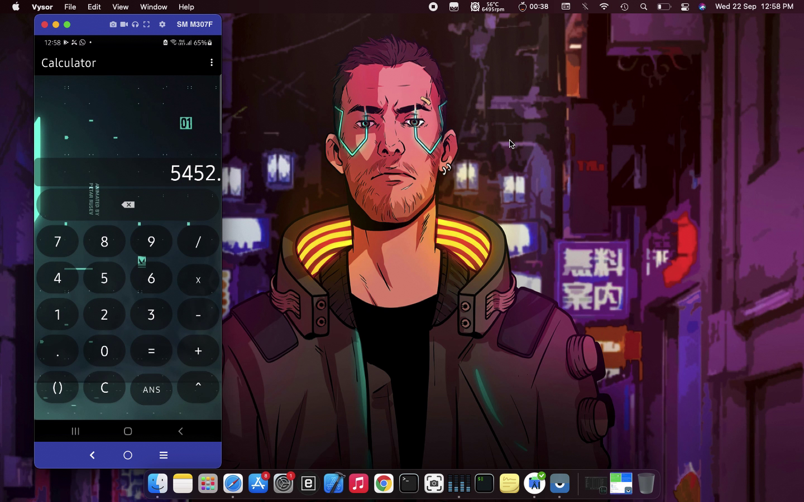
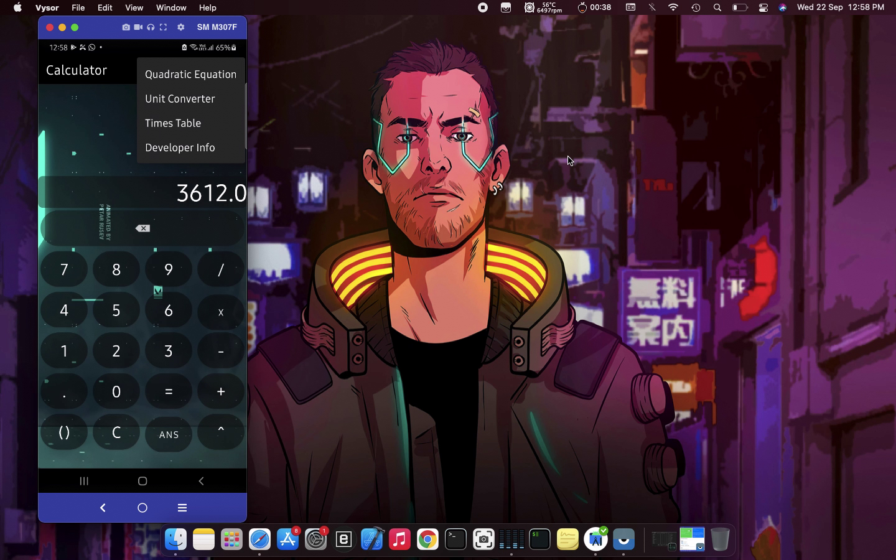
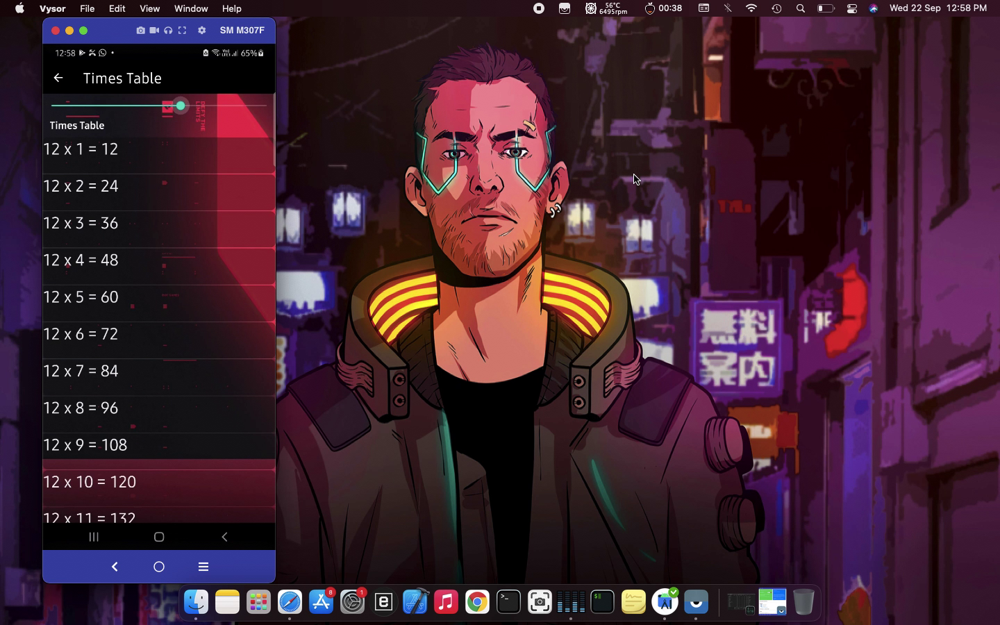

# Abacus-calci
Features:-
1. Calculator
2. Quadratic equation calculator
3. Unit converter
4. Base converter (decimal to hexadecimal, etc)
5. Times table

Preview images for this application are as below:

Splash screen:

Main Calculator Activity:

Quadratic equation Activity:

Times table activity:

Unit converter activity:

Length converter:

Weight converter:

Power converter:

Temperature converter:

Force converter:

Base Converter(for computer science Students):

