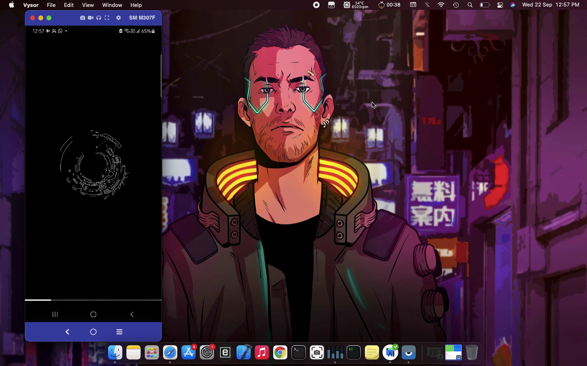
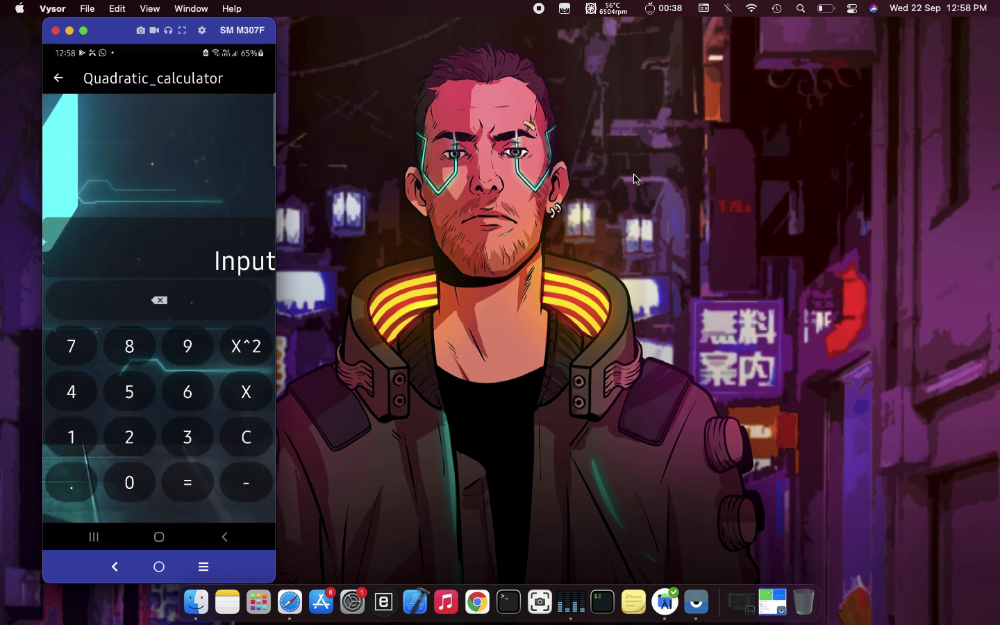
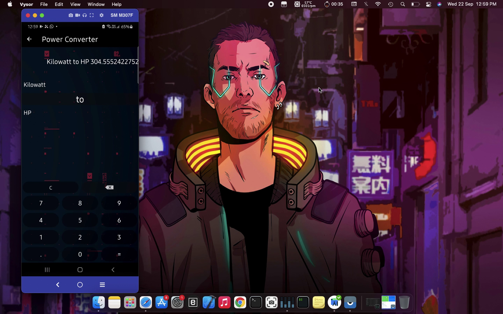
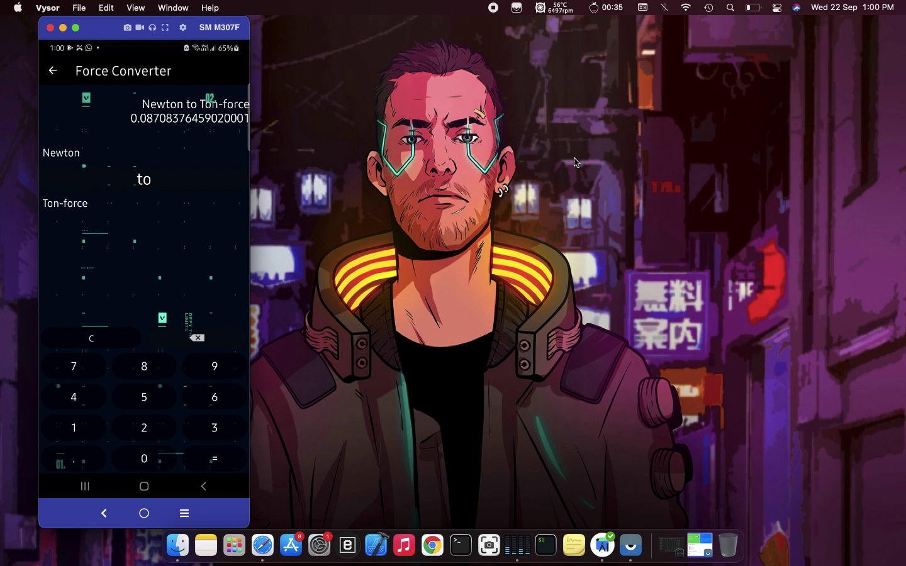
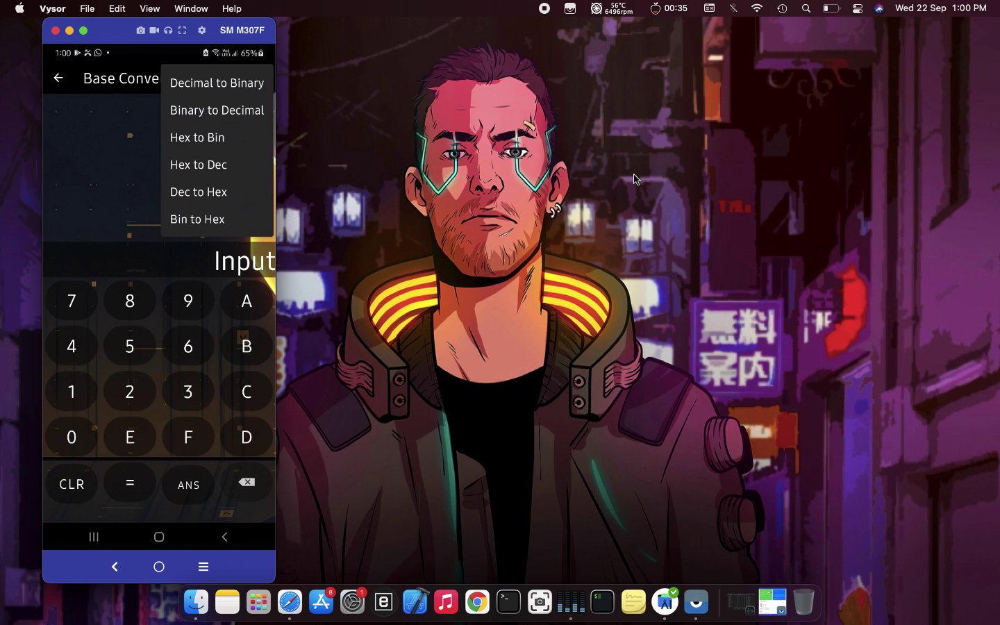

# Abacus-calci
This is the improved version of Abacus the calculator with improved User interface and aesthetics 
in order to use gif images in android projects you have to add 

step 1:- Add the lines below in build.gradel Project file
```buildscript {
    repositories {
        google()
        jcenter()
        mavenCentral() **
    }
    dependencies {
        classpath "com.android.tools.build:gradle:4.1.1"

        // NOTE: Do not place your application dependencies here; they belong
        // in the individual module build.gradle files
    }
}

allprojects {
    repositories {
        google()
        jcenter()
        mavenCentral() **
    }
}
```

step 2:- Add the dependency in you build.gradle Application file
```` 

implementation 'pl.droidsonroids.gif:android-gif-drawable:1.2.20'

````

step 2:- to use gif images in your activity xml files just type the following code:-
```<pl.droidsonroids.gif.GifImageView
        android:id="@+id/gifImageView"
        android:layout_width="match_parent"
        android:layout_height="0dp"
        android:src="@drawable/loading_file"
        app:layout_constraintBottom_toTopOf="@+id/SplashprogressBar"
        app:layout_constraintEnd_toEndOf="parent"
        app:layout_constraintStart_toStartOf="parent"
        app:layout_constraintTop_toTopOf="parent" />
        and you are good to go
```

Preview images for this application are as below:

Splash screen:


Main Calculator Activity:


Quadratic equation Activity:


Times table activity:


Unit converter activity:


Length converter:


Weight converter:


Power converter:


Temperature converter:


Force converter:


Base Converter(for computer science Students):

